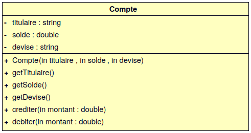
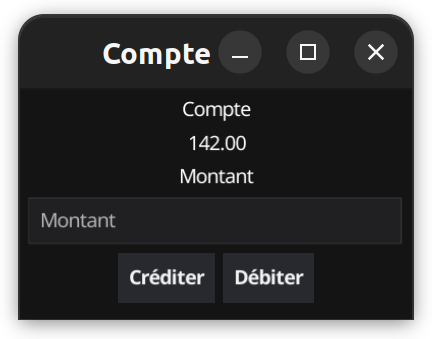
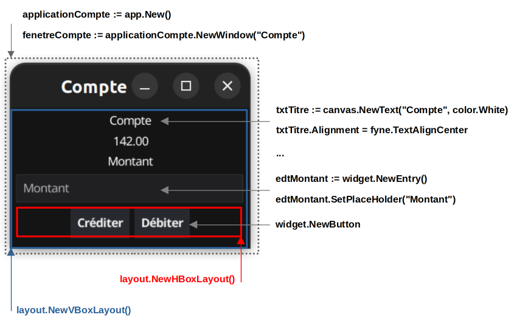
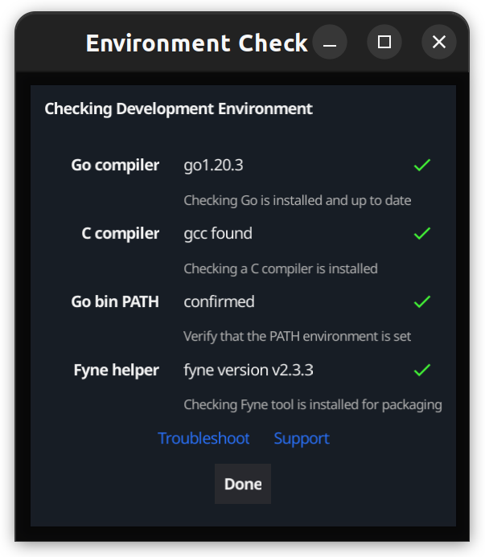
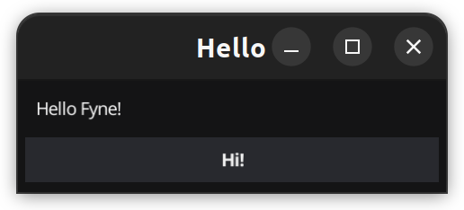
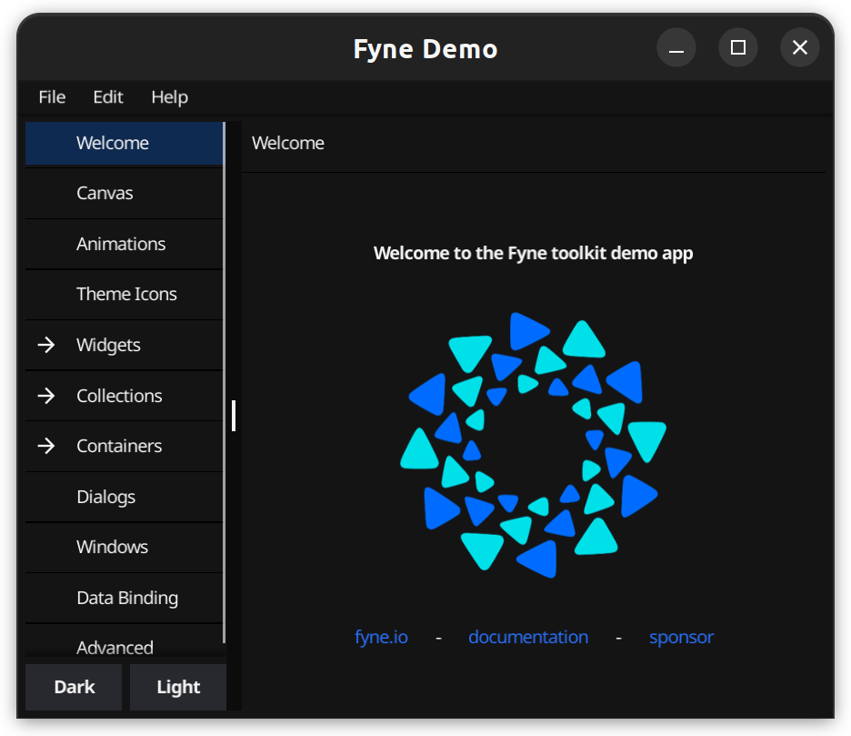

 

[](../../actions) [](../../actions)

# TP POO : Go

- [TP POO : Go](#tp-poo--go)
  - [Le langage Go](#le-langage-go)
    - [Présentation](#présentation)
    - [Le typage](#le-typage)
    - [La syntaxe](#la-syntaxe)
    - [Bibliothèques](#bibliothèques)
    - [POO](#poo)
      - [Notion de structure](#notion-de-structure)
      - [Notion de méthode](#notion-de-méthode)
      - [Notion d'interface](#notion-dinterface)
    - [Module (package)](#module-package)
  - [Travaux pratiques](#travaux-pratiques)
    - [Pré-requis](#pré-requis)
    - [Travail demandé](#travail-demandé)
    - [Bonus : application GUI mutliplateforme](#bonus--application-gui-mutliplateforme)
      - [Travail demandé](#travail-demandé-1)
      - [Fyne](#fyne)
  - [Bac à sable et développement en ligne](#bac-à-sable-et-développement-en-ligne)

Les objectifs de ce TP sont de s’initier à la programmation Go en transférant ses connaissances de la programmation orientée objet.

> Pour les enseignants, ceci est un "petit" devoir pour [Github Classroom](https://btssn-lasalle84.github.io/guides-developpement-logiciel/guide-classroom.html). Il montre l'utilisation des tests unitaires en Go, la notation automatique et l'insertion d'un badge pour l'affichage de la note.

## Le langage Go

Cette partie présente les éléments essentiels à connaître sur Go. Évidemment, cela ne remplace pas un cours ou la documentation officielle du langage.

### Présentation

Go est un langage de programmation compilé et concurrent inspiré de C et Pascal. Il a été développé par Google.

Le langage Go a été initialement créé pour la programmation système ce qui constitue la même cible que le C et surtout le C++.

> Go intègre directement les traitements de code en concurrence. Le mot clé `go` permet à un appel de fonction de s'exécuter en concurrence avec la _goroutine_ courante (par exemple, `go foo()`). Une _goroutine_ est un fil d'exécution supervisé par l'ordonnanceur inclus dans le _runtime_.

Ressources :

- Site officiel : https://go.dev/
- Installation : https://go.dev/doc/install
- Présentation du langage : https://go.dev/doc/ et https://go.dev/tour/
- Documentation des modules (_package_) : https://pkg.go.dev/
- Exemples : https://gobyexample.com/

> Le classement de Go à l'indice TIOBE : https://www.tiobe.com/tiobe-index/

### Le typage

Tous les langages de programmation permettent de manipuler des valeurs avec des variables.

Le typage d’une variable consiste à associer à son nom un « type » de donnée.

Pour rappel, le « type » est la convention d’interprétation (codage) de la séquence de bits qui constitue la variable. Le type de la variable spécifie aussi la longueur de cette séquence (8 bits, 32 bits, 64 bits, ...).

Suivant les langages de programmation, il existe plusieurs manières de considérer le typage :

- Typage statique : il consiste à demander au programmeur de déclarer expressément chaque variable en indiquant son type. Exemples de langage à typage statique : C, C++, Java, C#, Go
- Typage dynamique : il consiste à laisser l’interpréteur réaliser cette opération de typage « à la volée » lors de l’exécution du code. C’est la valeur affectée à la variable qui précisera son type. Exemples de langage à typage dynamique : PHP, Perl, Python, Javascript, bash (_shell_ Linux)
- Typage fort : Un langage de programmation est dit fortement typé lorsqu’il garantit que les types de données employés décrivent correctement les données manipulées. Exemples de langage fortement typé : C++, Java, C#, Python, Go
- Typage faible : Un langage de programmation est dit faiblement typé lorsqu’il ne considère pas comme une erreur les changements de types. Exemples de langage faiblement typé : PHP, Javascript, C (car il accepte les transtypages implicites comme `int` vers `short`)

Le langage Go est doté d’un **typage statique et fort**.

Exemple d’utilisation des types en Go (`src/type.go`) :

```go
package main

import "fmt"

func main() {
  var a int = 1  // un entier (ou int64)
  var b float64 = 2.5 // un nombre à virgule flottante (ou float)
  var c string = "hello" // une chaîne de caractères
  var d = false // un booléen
  e := "world" // déclare et initialise une variable
  const NB int = 10 // une constante
  var t[NB] int // un tableau d'entiers initialisés à 0
  var fruits = []string {"pomme", "banane", "fraise", "cerise"}

  // afficher une variable :
  fmt.Println(a)
  fmt.Println(b)
  fmt.Println(c)
  fmt.Println(d)
  fmt.Println(c + " " + e)
  fmt.Println(NB)
  fmt.Println(t[0])
  fmt.Println(fruits)
  fmt.Println(len(fruits))

  // cast
  var i int = 42
  var f float64 = float64(i)
  var u uint = uint(f)
  fmt.Printf("i : %T\n", i)
  fmt.Printf("f : %T\n", f)
  fmt.Printf("u : %T\n", u)
}
```

> Le compilateur ne tolère pas qu'une variable déclarée ne soit pas utilisée ! Dans Go, la gestion de la mémoire est assurée par un ramasse-miettes. Et le langage supporte les pointeurs.

### La syntaxe

Le langage Go propose une simplification de la syntaxe du C en supprimant par exemple les `;` et les parenthèses derrière le `if` et le `for` (et la boucle `while` se nomme `for` en Go).

Il est important de mettre l'accolade ouvrante `{` d'une structure (comme `if` ou `for`) sur la même ligne.

> Les choix syntaxiques de Go ne font pas l'unanimité ! Le langage s'est fait reprocher d'avoir « un moteur de Ferrari dans une carrosserie de Ford T »

### Bibliothèques

Les principales bibliothèques sont :

- `fmt` fournit 19 fonctions de mise en forme des entrées-sorties (`Println`, `Print`, `Printf`, `Scanf` ...)
- `fyne` fournit des _widgets_ pour créer des interfaces graphiques utilisateurs multiplateformes : Windows, Mac, Linux, Android...
- `io` fournit des procédures d'entrées-sorties (`ReadFull`, `Seek`, `WriteString` ...)
- `math` fournit un ensemble de fonctions mathématiques (`Min`, `Max`, `Sqrt`, `Log` ...)
- `os` interface le système, par exemple pour ouvrir et fermer des fichiers (`OpenFile`, `ReadAt` ...)
- `strings` fournit une cinquantaine de fonctions traitant des chaînes de caractères
- `time` fournit des outils de mesure des temps d'exécution (`Now`, `Since`)

On obtient la liste des bibliothèques avec `go list all` ou `go list -m all` pour les modules

Comme le C, Go exige d'indiquer quelles bibliothèques on utilisera avec l'instruction `import`. À la différence du C, il considère la compilation en erreur si cette bibliothèque n'est pas utilisée !

Documentation : https://pkg.go.dev/

### POO

Le langage Go n'est pas objet au sens classique (pas de notions de classe, ni de prototype).

> Le fait que Go ne soit pas objet au sens classique fait que Go n'a pas d'héritage de type et pas de sous-classage.

La programmation objet est toutefois possible en regroupant les notions de **structure**, de **méthode** et d'**interface**.

#### Notion de structure

Go permet de définir des **structures**. Les structures en Go sont des collections de champs typés (un regroupement de différents types).

Dans `src/poo.go` :

```go
// Une structure Point
type Point struct {
  Nom string
  X   int
  Y   int
}
```

On instancie un point :

```go
point := Point{"A", 1, 1}
```

#### Notion de méthode

Il est aussi possible de définir des **méthodes** sur des types. Une méthode est une fonction avec un argument récepteur spécial.

> Le récepteur apparaît dans sa propre liste d'arguments entre le mot clé `func` et le nom de la méthode.

```go
// Définit la méthode Affiche() liée à la structure Point
func (point Point) Affiche() {
  fmt.Printf("[%d,%d]\n", point.X, point.Y)
}

// Une méthode Distance()
func (point Point) Distance(p Point) float64 {
  var dx float64 = float64(point.X - p.X)
  var dy float64 = float64(point.Y - p.Y)
  return math.Sqrt(dx * dx + dy * dy)
}

// Définit la méthode SetCoordonnees() liée à la structure Point
// ici on utilise un pointeur pour modifier la variable point
func (point* Point) SetCoordonnees(x int, y int) {
  point.X = x
  point.Y = y
}

// Une fonction (pas une méthode !)
// Crée et retourne une instance par défaut de Point
func CreerPoint() Point {
  point := Point{"", 0, 0}
  return point
}
```

Soit le programme principal dans `src/poo.go` :

```go
func main() {
  p1 := Point{"p1", 2, 5}
  fmt.Println("X =", p1.X)
  fmt.Println("Y =", p1.Y)
  p1.Affiche()
  p2 := CreerPoint()
  p2.Affiche()
  distance := p1.Distance(p2);
  fmt.Println("distance =", distance)
  //...
}
```

> La visibilité des structures, attributs, variables, constantes, méthodes, types de haut niveau et des fonctions hors de leur paquetage (_package_) de déclaration est définie par la casse du premier caractère de leurs identificateurs : une Majuscule pour public et une minuscule pour privée.

#### Notion d'interface

Go ajoute la notion d'**interface** : un ensemble nommé de signatures de méthodes.

```go
// Une interface
// Ensemble de méthodes sur le type Point
type IPoint interface {
  Affiche()
  Distance(p Point) float64
  SetCoordonnees(x int, y int)
}
```

Ici, on peut dire que le type `Point` implémente l'interface `IPoint` puisqu'il possède toutes les méthodes.

Les fonctions Go peuvent déclarer accepter un argument de cette interface :

```go
// Une fonction acceptant un argument de l'interface IPoint
func foo(point IPoint) {
  fmt.Println(point)
    point.Affiche()
}
```

Un objet déclarant toutes les méthodes de cette interface, avec la même signature, peut être passé en argument de cette fonction.

Soit le programme principal dans `src/poo.go` :

```go
func main() {
  p1 := Point{"p1", 2, 5}
  //...
  p1.SetCoordonnees(3, 6)
  foo(p1)
}
```

On obtient au final :

```sh
$ go run poo.go
X = 2
Y = 5
p1(2,5)
(0,0)
distance = 5.385164807134504
{p1 3 6}
p1(3,6)
```

On exécute les tests unitaires :

```sh
$ go test -v poo.go poo_test.go
=== RUN   TestNomPoint
--- PASS: TestNomPoint (0.00s)
=== RUN   TestXPoint
--- PASS: TestXPoint (0.00s)
=== RUN   TestYPoint
--- PASS: TestYPoint (0.00s)
=== RUN   TestAffichePoint
--- PASS: TestAffichePoint (0.00s)
=== RUN   TestDistancePoint
    poo_test.go:63: La distance entre deux points
--- PASS: TestDistancePoint (0.00s)
=== RUN   TestCoordonneesPoint
--- PASS: TestCoordonneesPoint (0.00s)
PASS
ok  	command-line-arguments	0.001s
```

### Module (package)

L'unité de compilation de go est le _package_ qui est représenté par un répertoire et les fichiers qu'il contient.

L'`import` d'un _package_ se fait par son chemin d'importation et peut préciser soit une bibliothèque standard, soit également des packages tiers.

Chaque fichier source Go déclare de quel _package_ il fait partie en utilisant l'instruction `package`.

Création d'un module `point` en local (`src/poo/`) :

```sh
$ cd src
$ mkdir poo
$ cd poo
```

```sh
$ vim main.go
```
```go
package main

import (
  "fmt"
  "lasalle.com/poo/point"
)

// Une fonction acceptant un argument de l'interface IPoint
func foo(p point.IPoint) {
  fmt.Println(p)
    p.Affiche()
}

func main() {
    p1 := point.Point{"p1", 2, 5}
  fmt.Println("X =", p1.X)
  fmt.Println("Y =", p1.Y)
    p1.Affiche()
  p2 := point.CreerPoint()
  p2.Affiche()
  distance := p1.Distance(p2);
  fmt.Println("distance =", distance)
  foo(p1)
}
```

```sh
$ mkdir point
$ cd point
$ vim point.go
```
```go
package point

import (
  "fmt"
    "math"
)
...
```

```sh
$ cd ..
$ go mod init lasalle.com/poo
$ go mod edit -replace lasalle.com/poo=./point
$ go mod tidy
$ cat go.mod
module lasalle.com/poo

go 1.20

replace lasalle.com/poo => ./point

$ go run main.go
```

> Pour un dépôt GitHub, faire `go mod init github.com/$USER/$REPO`

## Travaux pratiques

### Pré-requis

Lien : https://go.dev/doc/install

Installation sous GNU/Linux Ubuntu avec `snap` :

```sh
$ sudo snap install --classic go
go 1.20.3 par Canonical✓ installé
```

Version de Go :

```sh
$ go version
go version go1.20.3 linux/amd64
```

Le programme `src/helloworld.go` :

```go
package main

import "fmt"

// Le programme
func main() {
  var langue string = "fr"
  var message string
  fmt.Print("Quelle est votre langue (fr, ...) ? ");
  // saisie d'une chaîne de caractères
  fmt.Scanf("%s", &langue)

  // une instruction conditionnelle
  if (langue == "fr") {
    message = "Bonjour le monde";
  } else {
    message = "Hello world";
  }

  // saisie d'un entier
  var nb int = 5
  fmt.Print("Donnez un nombre : ");
  fmt.Scanf("%d", &nb)

  var i int
  // une boucle
  for i = 0; i < nb; i++ {
    fmt.Printf("%s %d fois\n", message, (i+1))
  }
}
```

> Un programme Go doit posséder une fonction principale `func main() { ... }`.

Pour exécuter le programme :

```sh
$ go run helloworld.go
Quelle est votre langue (fr, ...) ? fr
Donnez un nombre : 4
Bonjour le monde 1 fois
Bonjour le monde 2 fois
Bonjour le monde 3 fois
Bonjour le monde 4 fois
```

Pour fabriquer un exécutable :

```sh
$ go build helloworld.go

$ ls -lh helloworld
-rwxrwxr-x 1 tv tv 2,0M avril 25 08:53 helloworld

$ file helloworld
helloworld: ELF 64-bit LSB executable, x86-64, version 1 (SYSV), statically linked, Go BuildID=pShInCrUA4zgGUniiaA8/Tk7_F3JdIF1Lox7yAqw3/O_FuByHvKGFhN3noI5-j/5pN0lqV-PDX_MArYnPD-, with debug_info, not stripped

$ ./helloworld
Quelle est votre langue (fr, ...) ? en
Donnez un nombre : 2
Hello world 1 fois
Hello world 2 fois
```

### Travail demandé

On souhaite disposer du concept de `Compte`.

Un `Compte` doit posséder un titulaire, un solde et une devise (EUR, USD, ...). On implémentera les accesseurs `Get` pour chaque propriété.

On disposera des méthodes suivantes :

- `Afficher()` qui affiche le `titulaire` et le `solde` du `Compte` dans la `devise`
- `Crediter()` d'un `montant` passé en argument le `solde` du `Compte`
- `Debiter()` d'un `montant` passé en argument le `solde` du `Compte`



> Le type `double` sera défini avec `float64`. Les méthodes commenceront par une majuscule, par exemple `GetTitulaire()` pour les rendre publics en dehors du _package_.

Fournir la "classe" `Compte` et ses méthodes dans `compte/compte.go`.

Exemple :

```go
$ cd compte
$ go run compte.go
Bill Gates - 105300000000.000000 USD
Moi - 42.000000 EUR
Maria - 1000.000000 YEN
Nouveau solde : 0.000000 EUR
Nouveau solde : 42.000000 EUR
```

Lancement des tests unitaires :

```sh
$ cd compte
$ go test -v compte.go compte_accesseurs_test.go
=== RUN   TestGetSoldeCompte
--- PASS: TestGetSoldeCompte (0.00s)
=== RUN   TestGetTitulaireCompte
--- PASS: TestGetTitulaireCompte (0.00s)
=== RUN   TestGetDeviseCompte
--- PASS: TestGetDeviseCompte (0.00s)
PASS
ok  	command-line-arguments	0.001s

$ go test -v compte.go compte_affichage_test.go
=== RUN   TestAfficherCompte1
--- PASS: TestAfficherCompte1 (0.00s)
=== RUN   TestAfficherCompte2
--- PASS: TestAfficherCompte2 (0.00s)
=== RUN   TestAfficherCompte3
--- PASS: TestAfficherCompte3 (0.00s)
PASS
ok  	command-line-arguments	0.001s

$ go test -v compte.go compte_test.go
=== RUN   TestCrediterCompte
--- PASS: TestCrediterCompte (0.00s)
=== RUN   TestDebiterCompte
--- PASS: TestDebiterCompte (0.00s)
=== RUN   TestCrediterDebiterCompte
--- PASS: TestCrediterDebiterCompte (0.00s)
PASS
ok  	command-line-arguments	0.001s
```

### Bonus : application GUI mutliplateforme

#### Travail demandé

Réaliser une application GUI en langage Go avec la bibliothèque `fyne` en exploitant le concept de `Compte`.



Compléter le code source fourni dans `fyne/compte/compte.go` :

```go
package main

import (
    "fmt"
    "strconv"

    "fyne.io/fyne/v2"
    "fyne.io/fyne/v2/app"
    "fyne.io/fyne/v2/canvas"
    "fyne.io/fyne/v2/container"
    "fyne.io/fyne/v2/layout"
    "fyne.io/fyne/v2/widget"
)

// Le concept de Compte

// Fonctions de services
func FloatToString(valeur float64) string {
    return strconv.FormatFloat(valeur, 'f', 2, 64)
}

func StringToFloat(valeur string) float64 {
    conversion, _ := strconv.ParseFloat(valeur, 64)
    return conversion
}

// Le compte
var monCompte Compte

// Les widgets
var txtTitre *canvas.Text
var txtSolde *canvas.Text
var txtMontant *canvas.Text
var edtMontant *widget.Entry
var btnCrediter *widget.Button
var btnDebiter *widget.Button

func CreerFenetreCompte() *fyne.Container {
    monCompte = CreerCompte("Moi", 42, "EUR")

    // TODO

    //return container.New(layout.NewVBoxLayout(), ...)
}

func main() {
    applicationCompte := app.New()
    fenetreCompte := applicationCompte.NewWindow("Compte")
    fenetreCompte.SetContent(CreerFenetreCompte())
    fenetreCompte.ShowAndRun()
}
```

On exécute le programme :

```sh
$ cd fyne/compte/
$ go mod init compte
$ go mod tidy
$ go run .
```

Tests unitaires :

```sh
$ go test -v compte.go compte_test.go
=== RUN   TestUICompte
--- PASS: TestUICompte (0.02s)
=== RUN   TestCrediterCompte
--- PASS: TestCrediterCompte (0.00s)
=== RUN   TestDebiterCompte
--- PASS: TestDebiterCompte (0.00s)
PASS
ok  	command-line-arguments	0.030s
```

Quelques _widgets_ et _layouts_ à mettre en oeuvre :

- https://developer.fyne.io/widget/label
- https://developer.fyne.io/widget/button
- https://developer.fyne.io/widget/entry
- https://developer.fyne.io/canvas/text
- https://developer.fyne.io/container/box



#### Fyne

La bibliothèque `fyne` fournit des _widgets_ pour créer des interfaces graphiques utilisateurs multiplateformes : Windows, Mac, Linux, Android...

Liens :

- https://fyne.io/
- https://developer.fyne.io/started/
- Documentation des modules `fyne` (_package_) : https://pkg.go.dev/fyne.io/fyne/v2/

Installation :

```sh
$ sudo apt-get install libgl1-mesa-dev xorg-dev
$ go install fyne.io/fyne/v2/cmd/fyne@latest
```

L'outil `fyne-croos` permet la _croos compilation_ des applications graphiques réalisées avec `fyne` en utilisant Podman ou Docker pour les images nécessaires à chaque plateforme.

> Il y a tout de même des restrictions liées à Apple.

```sh
$ go install github.com/fyne-io/fyne-cross@latest
```

Vérifications :

L'outil [Fyne Setup](https://geoffrey-artefacts.fynelabs.com/github/andydotxyz/fyne-io/setup/latest/) permet de vérifier l'environnement de développement :

```sh
$ wget -c https://geoffrey-artefacts.fynelabs.com/github/andydotxyz/fyne-io/setup/latest/linux-amd64/Fyne%20Setup-linux-amd64-508609c.tar.xz
$ tar -xJf Fyne\ Setup-linux-amd64-508609c.tar.xz
$ sudo make install
```

Puis :

```sh
$ export PATH=$PATH:$HOME/go/bin
$ setup
```



Hello world :

```sh
$ go run fyne.io/fyne/v2/cmd/hello@latest
```



"Mon Hello world" :

```sh
$ mkdir fyne
$ cd fyne/
$ mkdir helloworld
$ cd helloworld/

$ go mod init helloworld

$ vim main.go
package main

import (
  "fyne.io/fyne/v2/app"
  "fyne.io/fyne/v2/widget"
)

func main() {
  a := app.New()
  w := a.NewWindow("Hello World")

  w.SetContent(widget.NewLabel("Hello World!"))
  w.ShowAndRun()
}

$ go mod tidy

$ go build .

$ ls -lh helloworld
-rwxrwxr-x 1 tv tv 22M avril 25 20:49 helloworld

$ file helloworld
helloworld: ELF 64-bit LSB executable, x86-64, version 1 (SYSV), dynamically linked, interpreter /lib64/ld-linux-x86-64.so.2, BuildID[sha1]=c3cff59d4a4ddaa784388602b3102986c2a2c5d2, for GNU/Linux 3.2.0, with debug_info, not stripped

$ ./helloworld

// ou :
$ export PATH=$PATH:$HOME/go/bin
$ fyne build
```

Le programme de démonstration fourni :

```sh
$ go run fyne.io/fyne/v2/cmd/fyne_demo@latest
```




## Bac à sable et développement en ligne

Il est souvent nécessaire de passer par un "bac à sable".

> En informatique, le bac à sable (sandbox) est une zone d'essai permettant d'exécuter des programmes en phase de test ou dans lesquels la confiance est incertaine. C'est notamment très utilisé en sécurité informatique pour sa notion d'isolation.

Il existe de nombreux sites web qui fournissent des EDI (Environnement de Développement Intégré) en ligne pour tester du code ou des services : un espace d'apprentissage séparé. Ils permettent aussi d'échanger des exemples.

Quelques sites :

- The Go Playground : https://go.dev/play/
- Coding Ground For Developers : https://www.tutorialspoint.com/codingground.htm pour tout !
  - Go : https://www.tutorialspoint.com/execute_golang_online.php
  - Markdown : https://www.tutorialspoint.com/online_markdown_editor.php
- Visual Studio Code Online : https://vscode.dev/
- Codeanywhere (Cloud IDE) : https://codeanywhere.com/

---
Thierry Vaira : **[thierry(dot)vaira(at)gmail(dot)com](mailto:thierry.vaira@gmail.com)**
